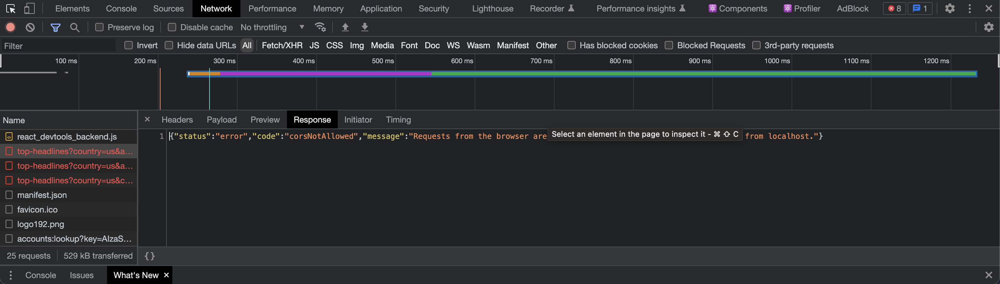

<!-- # DTS REA4 Final Project

Ketentuan lengkap bisa dilihat di [Final Project Guidelines](https://docs.google.com/document/d/122KyWNQ4xxU4aFwWbM4vIfH7LM4AH2CZEZa3YsEHjCk).

## Daftar pair

Tugas dikerjakan secara berpasangan, untuk daftar kelompok bisa dilihat pada masing-masing Classroom atau Discord Class.

## Fork and Clone

Mohon perwakilan dari pair bisa melakukan fork repo ini dan clone, untuk repositori yang di fork menggunakan penamaan:

`dts4[a/b/c]-[nomor pair]-final`

Contoh: `dts4a-01-final`

## Branching, commit

Branch dapat sesuai dengan kebutuhan dan kesepakatan bersama dalam pair, namun hasil akhirnya harus di merge ke branch `main` dan di push ke Github. Pastikan hasil akhir kode sudah ter-push!

 -->

# DTS REA4 FINAL PROJECT

## API YANG DIGUNAKAN

https://newsapi.org/

## Link live app

https://dts-rea4c.web.app/

- API yang digunakan tidak dapat muncul pada app yang sudah dideploy karena ada batasan limit dari penyedia API (CORS ISSUE)

## Link GITHUB

https://github.com/reinhardjk14/dts4c-18-final

## Demo

## Details

Merupakan sebuah website berita simple yang diambil menggunakan API https://newsapi.org/ , memiliki fungsi register, login, dan logout.

## Member

Reinhard Jordi Kurniawan
